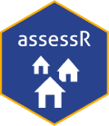

<!-- README.md is generated from README.Rmd. Please edit that file -->

# AssessR package <a href="https://github.com/ccao-data/assessr"></a>

AssessR is a software package for R developed by the Cook County
Assessor’s (CCAO) Data Science Department. This package is used in the
CCAO’s custom-built Computer Assisted Mass Appraisal system. The
codebase for the CCAO’s CAMA system uses a wide range of functions
regularly, and packaging these functions streamlines and standardizes
their use. The CCAO is publishing this package to make it available to
assessors, reporters, and citizens everywhere.

For assessors, we believe that this package will reduce the complexity
of calculating ratio statistics and detecting sales chasing. We also
believe that reporters, taxpayers, and members of academia will find
this package helpful in monitoring the performance of local assessors
and conducting research.

For detailed documentation on included functions and data, [**visit the
full reference
list**](https://ccao-data.github.io/assessr/reference/index.html).

For examples of specific tasks you can complete with `assessr`
functions, see the [**vignettes
page**](https://ccao-data.github.io/assessr/articles/index.html).

## Installation

You can install the released version of `assessr` directly from GitLab
with one of the following commands:

``` r
# Using remotes
remotes::install_github("ccao-data/assessr")

# Using renv
renv::install("ccao-data/assessr")

# Using pak
pak::pak("ccao-data/assessr")

# Append the @ symbol for a specific version
remotes::install_github("ccao-data/assessr@0.4.4")
```

Once it is installed, you can use it just like any other package. Simply
call `library(assessr)` at the beginning of your script.
