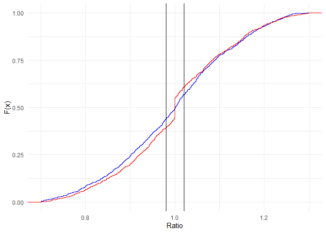

<!-- README.md is generated from README.Rmd. Please edit that file -->

# AssessR Package <a href="https://gitlab.com/ccao-data-science---modeling/packages/assessr"></a>

An R package to measure the performance of property assessments using
standard statistics. Also includes a host of utility functions to make
common assessment and evaluation tasks easier and more consistent.

## Installation

You can install the released version of `assessr` directly from GitLab
by running the following R command after installing the `remotes`
package:

``` r
remotes::install_gitlab("ccao-data-science---modeling/packages/assessr")

# Or, to install a specific version
remotes::install_gitlab("ccao-data-science---modeling/packages/assessr@0.2.0")
```

Once it is installed, you can use it just like any other package. Simply
call `library(assessr)` at the beginning of your script.

## Example Usage

### Sales Chasing Detection

Sales chasing is when a property is selectively reappraised to shift its
assessed value toward its actual sale price. The included function
`detect_chasing()` uses novel methods to detect potential sales chasing.
It is *not* a statistical test and is not absolute; visual inspection of
ratios is still recommended.

``` r
library(ggplot2)
library(dplyr)
library(assessr)
library(knitr)

# Generate distributions of fake ratios, including one with "sales chasing"
normal_ratios <- c(rnorm(1000, 1, 0.15))
chased_ratios <- c(rnorm(900, 1, 0.15), rep(1, 100)) 

# Plot the CDFs of each vector. Notice the flat spot on the red CDF
ggplot() +
  stat_ecdf(data = data.frame(x = normal_ratios), aes(x), color = "blue") +
  stat_ecdf(data = data.frame(x = chased_ratios), aes(x), color = "red") +
  geom_vline(xintercept = 0.98) +
  geom_vline(xintercept = 1.02) +
  xlim(0.7, 1.3) +
  labs(x = "Ratio", y = "F(x)") +
  theme_minimal()
```



``` r

# Detect chasing for each vector
tibble(
  "Blue Chased?" = detect_chasing(normal_ratios),
  "Red Chased?" = detect_chasing(chased_ratios)
) %>%
 kable(format = "markdown", digits = 3)
```

| Blue Chased? | Red Chased? |
| :----------- | :---------- |
| FALSE        | TRUE        |

### Sales Ratio Study Using Sample Data

Using the included `ratios_sample` dataset, `cod()`, `prd()`, and
`prb()` can be used to measure the performance of an assessment.

``` r

# Load the sample dataset
data("ratios_sample")

# Calculate peformance statistics by township
ratios_sample %>%
  group_by(town) %>%
  summarize(
    cod = cod(ratio),
    cod_ci = paste(round(cod_ci(ratio, nboot = 1000), 3), collapse = ", "),
    cod_met = cod_met(cod),
    prd = prd(assessed, sale_price),
    prd_ci = paste(round(prd_ci(assessed, sale_price), 3), collapse = ", "),
    prd_met = prd_met(prd)
  ) %>%
  rename_all(toupper) %>%
  kable(format = "markdown", digits = 3)
```

| TOWN      |    COD | COD\_CI        | COD\_MET |   PRD | PRD\_CI      | PRD\_MET |
| :-------- | -----: | :------------- | :------- | ----: | :----------- | :------- |
| Evanston  | 16.398 | 14.681, 18.198 | FALSE    | 1.033 | 1.009, 1.053 | FALSE    |
| New Trier | 19.150 | 16.957, 21.326 | FALSE    | 1.066 | 1.049, 1.085 | FALSE    |

### Sales Ratio Study Using Real Data

This package can easily be used with data from the [Cook County Open
Data
Portal](https://datacatalog.cookcountyil.gov/Property-Taxation/Cook-County-Assessor-s-Residential-Assessments/uqb9-r7vn)
to analyze assessment performance. To measure assessment performance,
you will need to gather both sales and assessed values. These are stored
in two separate datasets on the data portal.

#### With RSocrata

[RSocrata](https://github.com/Chicago/RSocrata) is a package developed
by the City of Chicago to wrap Socrata API requests. It allows you to
easily pass a Socrata app token, which will remove the API limit on the
number of rows returned. Example usage is shown below, replacing the
login details with your own.

``` r
library(RSocrata)

# Load unlimited rows of assessment data, default is 1,000
assessments <- read.socrata(
  "https://datacatalog.cookcountyil.gov/resource/uqb9-r7vn.json",
  app_token = "YOURAPPTOKENHERE",
  email     = "user@example.com",
  password  = "fakepassword"
)
```

#### With jsonlite

Socrata can also return raw JSON if you manually construct a query URL.
Follow the [API
docs](https://dev.socrata.com/foundry/datacatalog.cookcountyil.gov/uqb9-r7vn)
to alter your query. The raw JSON output can be read using the
`read_json()` function from `jsonlite`.

``` r
library(jsonlite)

# Load 100k rows of assessment data
assessments <- read_json(
  "https://datacatalog.cookcountyil.gov/resource/uqb9-r7vn.json?$limit=100000",
  simplifyVector = TRUE
)

# Load 100k rows of sales data
sales <- read_json(
  "https://datacatalog.cookcountyil.gov/resource/5pge-nu6u.json?$limit=100000",
  simplifyVector = TRUE
)
```

#### Example Analysis

Using the collected assessment and sales data, we can perform a
rudimentary analysis and measure the performance of each town ship at
each stage of assessment.

``` r
library(dplyr)
library(tidyr)
library(knitr)

# Join the two datasets based on PIN, keeping only properties that have assessed
# values AND sales
combined <- inner_join(
  assessments %>% select(pin, year, town_name, first_pass, certified, bor_result),
  sales %>% select(pin, year = sale_year, sale_price),
  by = c("pin", "year")
)

# Remove sales that are not arms length, pivot to longer, then calculate 
# the ratio for each property and assessment stage
combined <- combined %>% 
  filter(sale_price >= 10000) %>%
  pivot_longer(
    first_pass:bor_result,
    names_to = "stage",
    values_to = "assessed"
  ) %>%
  mutate_at(vars(sale_price, assessed), as.numeric) %>%
  mutate(ratio = assessed / sale_price)


# For each town and stage, calculate COD, PRD, and PRB, and their respective
# confidence intervals then arrange by town name and stage of assessment
combined %>%
  group_by(town_name, stage) %>%
  summarise(
    n = n(),
    cod = cod(ratio),
    cod_ci = paste(round(cod_ci(ratio, nboot = 1000), 3), collapse = ", "),
    cod_met = cod_met(cod),
    prb = prb(assessed, sale_price),
    prb_ci = paste(round(prb_ci(assessed, sale_price), 3), collapse = ", "),
    prb_met = prb_met(prb)
  ) %>%
  filter(n >= 50) %>%
  mutate(stage = factor(
    stage,
    levels = c("first_pass", "certified", "bor_result"))
  ) %>%
  arrange(town_name, stage) %>%
  rename_all(toupper) %>%
  kable(format = "markdown")
```

| TOWN\_NAME  | STAGE       |   N |      COD | COD\_CI        | COD\_MET |         PRB | PRB\_CI         | PRB\_MET |
| :---------- | :---------- | --: | -------: | :------------- | :------- | ----------: | :-------------- | :------- |
| ELK GROVE   | first\_pass |  71 | 27.78232 | 18.887, 38.567 | FALSE    | \-0.1188841 | \-0.263, 0.026  | FALSE    |
| ELK GROVE   | certified   |  71 | 24.46860 | 15.929, 35.72  | FALSE    | \-0.0169422 | \-0.154, 0.12   | TRUE     |
| ELK GROVE   | bor\_result |  71 | 23.49757 | 15.294, 35.598 | FALSE    | \-0.0174319 | \-0.152, 0.118  | TRUE     |
| EVANSTON    | first\_pass |  53 | 26.50670 | 14.858, 44.18  | FALSE    |   0.1394950 | \-0.049, 0.328  | FALSE    |
| EVANSTON    | certified   |  53 | 26.38652 | 13.766, 45.306 | FALSE    |   0.1386032 | \-0.052, 0.329  | FALSE    |
| EVANSTON    | bor\_result |  53 | 26.34999 | 14.505, 43.79  | FALSE    |   0.1311480 | \-0.062, 0.325  | FALSE    |
| LAKE VIEW   | first\_pass | 291 | 20.05137 | 15.244, 25.637 | FALSE    | \-0.0163193 | \-0.069, 0.037  | TRUE     |
| LAKE VIEW   | certified   | 291 | 18.49785 | 15.124, 22.169 | FALSE    | \-0.0384815 | \-0.078, 0.001  | TRUE     |
| LAKE VIEW   | bor\_result | 291 | 18.44955 | 14.986, 22.113 | FALSE    | \-0.0425709 | \-0.082, -0.003 | TRUE     |
| NEW TRIER   | first\_pass |  62 | 19.86714 | 15.743, 23.937 | FALSE    |   0.0065982 | \-0.07, 0.083   | TRUE     |
| NEW TRIER   | certified   |  62 | 21.08162 | 16.646, 24.996 | FALSE    | \-0.0007468 | \-0.08, 0.079   | TRUE     |
| NEW TRIER   | bor\_result |  62 | 15.68523 | 12.044, 19.896 | FALSE    | \-0.0420508 | \-0.108, 0.024  | TRUE     |
| OAK PARK    | first\_pass |  53 | 28.73249 | 19.859, 38.431 | FALSE    | \-0.0808581 | \-0.234, 0.072  | FALSE    |
| OAK PARK    | certified   |  53 | 28.90091 | 20.783, 38.821 | FALSE    | \-0.0576492 | \-0.211, 0.096  | FALSE    |
| OAK PARK    | bor\_result |  53 | 29.96451 | 20.501, 40.891 | FALSE    | \-0.0595960 | \-0.219, 0.1    | FALSE    |
| PALOS       | first\_pass |  57 | 22.94833 | 16.551, 29.305 | FALSE    |   0.1270371 | 0.005, 0.249    | FALSE    |
| PALOS       | certified   |  57 | 23.20667 | 16.881, 29.572 | FALSE    |   0.1398959 | 0.018, 0.262    | FALSE    |
| PALOS       | bor\_result |  57 | 21.78137 | 15.435, 28.44  | FALSE    |   0.1260804 | 0.008, 0.244    | FALSE    |
| ROGERS PARK | first\_pass |  59 | 25.75073 | 15.966, 37.88  | FALSE    | \-0.0235310 | \-0.159, 0.112  | TRUE     |
| ROGERS PARK | certified   |  59 | 25.79628 | 16.247, 37.176 | FALSE    | \-0.0254053 | \-0.161, 0.11   | TRUE     |
| ROGERS PARK | bor\_result |  59 | 25.87248 | 16.362, 37.702 | FALSE    | \-0.0266601 | \-0.162, 0.109  | TRUE     |
