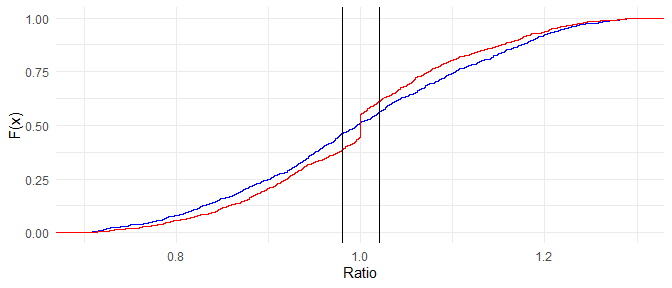

<!-- README.md is generated from README.Rmd. Please edit that file -->

# AssessR Package <a href="https://gitlab.com/ccao-data-science---modeling/packages/assessr"></a>

AssessR is a software package for R developed by the Cook County
Assessor’s (CCAO) Data Science Department. This package is used in the
CCAO’s custom-built Computer Assisted Mass Appraisal system. The
codebase for the CCAO’s CAMA system uses a wide range of functions
regularly, and packaging these functions streamlines and standardizes
their use. The CCAO is publishing this package to make it available to
assessors, reporters, and citizens everywhere.

For assessors, we believe that this package will reduce the complexity
of calculating ratio statistics and detecting sales chasing. We also
believe that reporters, taxpayers, and members of academia will find
this package helpful in monitoring the performance of local assessors
and conducting research.

For detailed documentation on included functions and data, [**visit the
full reference
list**](https://ccao-data-science---modeling.gitlab.io/packages/assessr/reference/).

For examples of specific tasks you can complete with `assessr`
functions, see the [**vignettes
page**](https://ccao-data-science---modeling.gitlab.io/packages/assessr/articles/index.html).

## Installation

You can install the released version of `assessr` directly from GitLab
by running the following R command after installing
[remotes](https://github.com/r-lib/remotes):

``` r
remotes::install_gitlab("ccao-data-science---modeling/packages/assessr")

# Or, to install a specific version
remotes::install_gitlab("ccao-data-science---modeling/packages/assessr@0.3.0")
```

Once it is installed, you can use it just like any other package. Simply
call `library(assessr)` at the beginning of your script.

## Basic Usage

### Sales Ratio Study Using Sample Data

Using the included `ratios_sample` dataset, `cod()`, `prd()`, and
`prb()` can be used to measure the performance of an assessment.

``` r
library(assessr)
library(ggplot2)
library(dplyr)
library(knitr)

# Load the sample dataset
data("ratios_sample")

# Calculate peformance statistics by township
ratios_sample %>%
  group_by(town) %>%
  summarize(
    cod = cod(ratio),
    cod_ci = paste(round(cod_ci(ratio, nboot = 1000), 3), collapse = ", "),
    cod_met = cod_met(cod),
    prd = prd(assessed, sale_price),
    prd_ci = paste(round(prd_ci(assessed, sale_price), 3), collapse = ", "),
    prd_met = prd_met(prd)
  ) %>%
  rename_all(toupper) %>%
  kable(format = "markdown", digits = 3)
```

| TOWN      |    COD | COD\_CI        | COD\_MET |   PRD | PRD\_CI      | PRD\_MET |
| :-------- | -----: | :------------- | :------- | ----: | :----------- | :------- |
| Evanston  | 16.398 | 14.489, 18.391 | FALSE    | 1.033 | 1.009, 1.058 | FALSE    |
| New Trier | 19.150 | 17.13, 21.444  | FALSE    | 1.066 | 1.048, 1.092 | FALSE    |

### Sales Chasing Detection

Sales chasing is when a property is selectively reappraised to shift its
assessed value toward its actual sale price. The included function
`detect_chasing()` uses novel methods to detect potential sales chasing.
It is *not* a statistical test and is not absolute; visual inspection of
ratios is still recommended.

``` r

# Generate distributions of fake ratios, including one with "sales chasing"
normal_ratios <- c(rnorm(1000, 1, 0.15))
chased_ratios <- c(rnorm(900, 1, 0.15), rep(1, 100)) 

# Plot the CDFs of each vector. Notice the flat spot on the red CDF
ggplot() +
  stat_ecdf(data = data.frame(x = normal_ratios), aes(x), color = "blue") +
  stat_ecdf(data = data.frame(x = chased_ratios), aes(x), color = "red") +
  geom_vline(xintercept = 0.98) +
  geom_vline(xintercept = 1.02) +
  xlim(0.7, 1.3) +
  labs(x = "Ratio", y = "F(x)") +
  theme_minimal()
```



``` r

# Detect chasing for each vector
tibble(
  "Blue Chased?" = detect_chasing(normal_ratios),
  "Red Chased?" = detect_chasing(chased_ratios)
) %>%
 kable(format = "markdown", digits = 3)
```

| Blue Chased? | Red Chased? |
| :----------- | :---------- |
| FALSE        | TRUE        |
